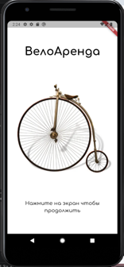
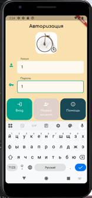
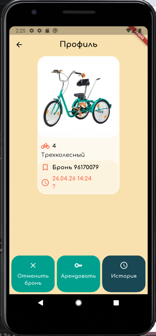
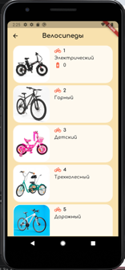

# bike_rental_2

A new Flutter project.

## Getting Started

Добро пожаловать в демо-приложение для аренды велосипедов!

Это приложение — простой и быстрый способ найти «железного коня» для прогулки в парке или поездки по делам.

Что можно сделать в этой версии:
Посмотреть доступные модели.
Оценить удобный интерфейс.
Проверить, как работают бронирование и ареда.

Подготовлены тестовые аккаунты, чтобы вы могли всё изучить прямо сейчас без лишних регистраций:
Пользователь №1: логин: 1, пароль: 1
Пользователь №2: логин: 2, пароль: 2

Заходите, тестируйте и чувствуйте ветер в волосах (пусть пока и виртуальный)!

